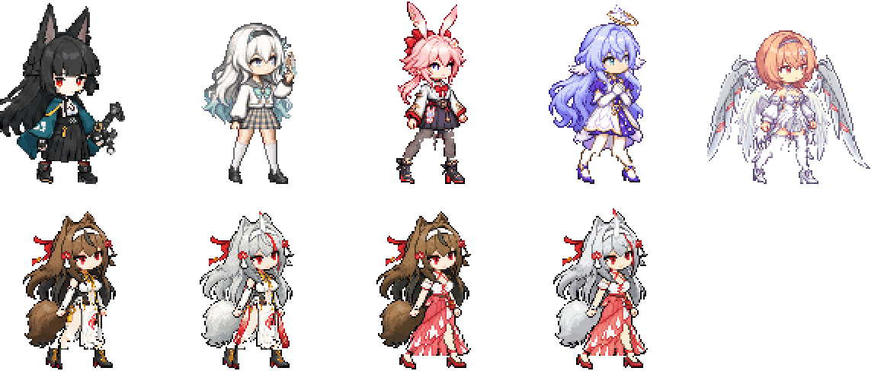
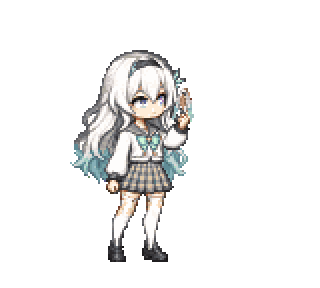
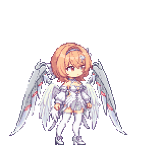
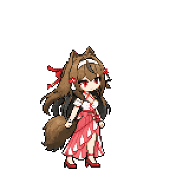
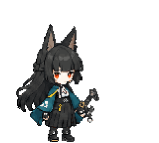
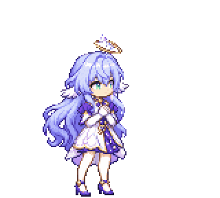
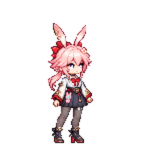

<div align="center">

# ✦ Chibi Taskbar Pets ✦

**Pixel-art HoYoverse companions that live on your Windows taskbar.**
**Những bé chibi pixel HoYoverse sống ngay trên thanh taskbar Windows của bạn.**




[English](#-english) · [Tiếng Việt](#-tiếng-việt)

</div>

---

## ✨ Signature moves · Chiêu đặc trưng

<table>
<tr>
<td align="center"><br><b>Firefly</b><br><sub>SAM henshin · green flame climbs, arms cross, two swords summoned</sub></td>
<td align="center"><br><b>Remielle</b><br><sub>feather-wing sweep · touching her upper Thaumiel wing</sub></td>
</tr>
<tr>
<td align="center"><br><b>Ye Shunguang</b><br><sub>sword case lands · a ring of blades circles her</sub></td>
<td align="center"><br><b>Hoshimi Miyabi</b><br><sub>crescent unsheath</sub></td>
</tr>
<tr>
<td align="center"><br><b>Robin</b><br><sub>on-stage song</sub></td>
<td align="center"><br><b>Evanescia</b><br><sub>quick-draw slash</sub></td>
</tr>
</table>

---

## 🇬🇧 English

### What it is
A tiny Electron app that puts a pixel-chibi character on top of your taskbar. She walks around,
idles, gets hungry, falls asleep, and every now and then performs her **signature move**.
Everything is driven by a small, seeded behaviour engine — no two sessions look the same.

### Characters
| Character | Game | Forms |
| --- | --- | --- |
| Hoshimi Miyabi | Zenless Zone Zero | — |
| Firefly | Honkai: Star Rail | human ↔ SAM armor (in her signature) |
| Evanescia | Honkai: Star Rail | — |
| Robin | Honkai: Star Rail | — |
| Remielle | Zenless Zone Zero | in-game Thaumiel wings |
| Ye Shunguang | Zenless Zone Zero | white qipao / red outfit × normal / white-hair form (4 skins) |

### Features
- 🐾 **Real stride walk** — painted 2-bone IK legs, planted feet never slide (≤ 0.8 px).
- 🍙 **Needs** — hunger rises over time (tray → *Feed*), sleepiness leads to sit → sleep → wake.
- ⚔️ **Signature actions** — hand-timed clips with procedural FX: clinging flame, flame vortex,
  crescent slashes, orbiting sword ring, ribbons, feathers, sparkles.
- 🪞 **Right-authored, mirrored at runtime** — every pack stores one direction only.
- 📦 **Strict clip-pack contract** — packs are validated before they load; a broken pack never
  replaces a working pet.
- 🧪 **40 automated tests** for the runtime, movement, needs and pack contract.

### Quick start
```bash
cd src/taskbar-pet
npm install
npm start
```
Right-click the tray icon to pick a character, **Feed** her, or **Quit**.

| Command | What it does |
| --- | --- |
| `npm start` | run from source |
| `npm test` | run the 40 runtime tests |
| `npm run build:win:portable` | build a portable `.exe` into `src/taskbar-pet/dist/` |

### How the art is made
```
3D model render ─┐
in-game footage ─┼─► imagegen key poses ─► post-process (palette lock, 6× grid, baseline)
                 │                          │
                 └──────────────────────────┴─► clip builder (rig bob, FX, props) ─► runtime pack
```
- `scripts/imagegen_postprocess.py` — snaps an imagegen frame back to the 160×144 grid and the locked palette.
- `scripts/build_pet_clip.py` — assembles clips from approved key poses plus procedural FX.
- `scripts/build_painted_walk.py` — IK walk cycles.
- `scripts/build_runtime_pack.py` — publishes `assets/runtime/taskbar-pet/clip-packs/<char>/v2/`.
- `scripts/build_readme_media.py` — regenerates the GIFs on this page.

---

## 🇻🇳 Tiếng Việt

### Đây là gì
Một app Electron nhỏ đặt một bé chibi pixel lên trên thanh taskbar. Bé tự đi lại, đứng nghỉ,
biết đói, buồn ngủ, và thỉnh thoảng tung **chiêu đặc trưng**. Hành vi do một engine ngẫu nhiên
có seed điều khiển — mỗi lần chạy là một kiểu khác nhau.

### Nhân vật
| Nhân vật | Game | Dạng |
| --- | --- | --- |
| Hoshimi Miyabi | Zenless Zone Zero | — |
| Firefly | Honkai: Star Rail | người ↔ giáp SAM (trong chiêu) |
| Evanescia | Honkai: Star Rail | — |
| Robin | Honkai: Star Rail | — |
| Remielle | Zenless Zone Zero | cánh Thaumiel như trong game |
| Ye Shunguang | Zenless Zone Zero | sườn xám trắng / đồ đỏ × dạng thường / dạng tóc trắng (4 skin) |

### Tính năng
- 🐾 **Dáng đi thật** — chân vẽ bằng IK 2 khớp, bàn chân chạm đất không bị trượt (≤ 0,8 px).
- 🍙 **Nhu cầu** — đói dần theo thời gian (chuột phải khay → *Feed* để cho ăn), buồn ngủ thì ngồi → ngủ → dậy.
- ⚔️ **Chiêu đặc trưng** — clip căn nhịp thủ công kèm hiệu ứng vẽ bằng code: lửa ôm viền người,
  lốc lửa, vệt chém trăng khuyết, vòng kiếm bay, ruy băng, lông vũ, lấp lánh.
- 🪞 **Chỉ vẽ hướng phải** — runtime tự lật hình khi đi sang trái.
- 📦 **Hợp đồng clip-pack chặt chẽ** — pack được kiểm tra trước khi nạp; pack lỗi không thay được pet đang chạy.
- 🧪 **40 test tự động** cho runtime, di chuyển, nhu cầu và hợp đồng pack.

### Chạy thử
```bash
cd src/taskbar-pet
npm install
npm start
```
Chuột phải vào icon ở khay hệ thống để chọn nhân vật, **Feed** (cho ăn) hoặc **Quit** (thoát).

| Lệnh | Tác dụng |
| --- | --- |
| `npm start` | chạy từ mã nguồn |
| `npm test` | chạy 40 test runtime |
| `npm run build:win:portable` | đóng gói file `.exe` chạy ngay vào `src/taskbar-pet/dist/` |

### Quy trình làm hình
Render model 3D và video quay trong game làm tham chiếu → imagegen vẽ các dáng chính →
hậu kỳ khoá bảng màu, khớp lưới pixel 6×, cân chân → bộ dựng clip thêm nhún nhảy, hiệu ứng,
đạo cụ → xuất pack runtime. Chi tiết các script ở phần tiếng Anh phía trên.

---

<div align="center">

### Disclaimer · Lưu ý

Fan-made, non-commercial project. Characters and designs © HoYoverse (miHoYo).
Not affiliated with or endorsed by HoYoverse. Game footage and 3D models used as drawing
references are kept locally and are **not** included in this repository.

Dự án fan làm, phi thương mại. Nhân vật và thiết kế thuộc bản quyền HoYoverse (miHoYo).
Không liên kết với HoYoverse. Video game và model 3D dùng làm tham chiếu chỉ để trên máy,
**không** đưa vào repo này.

<sub>Built on the <a href="docs/studio/CODEX-STUDIO-README.md">Codex Code Game Studios</a> template (MIT).</sub>

</div>
